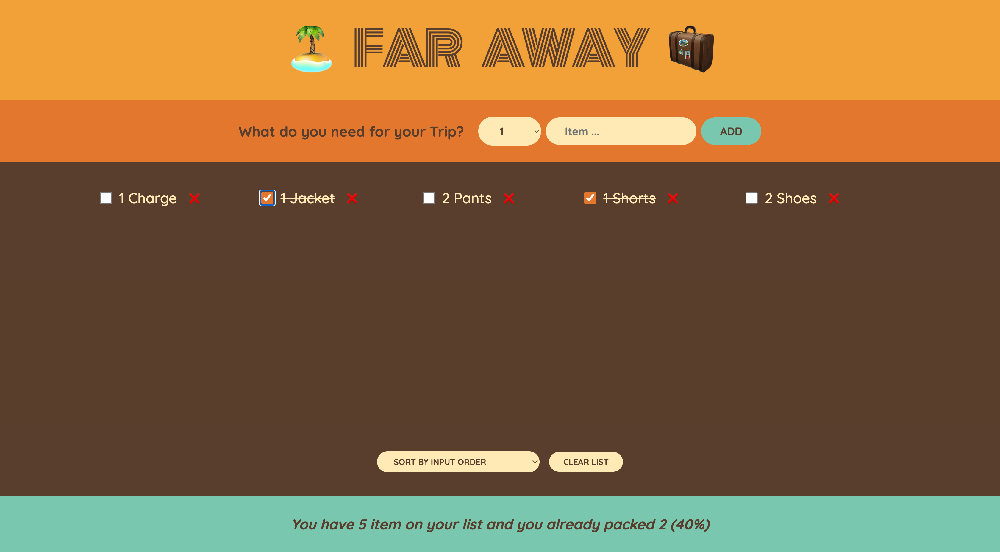

# Travel List App

The **Travel List App** is a simple web application designed to help you manage the items you need to pack for your vacation. It functions like a to-do list, allowing you to add, remove, and mark items as packed for your trip.

## Features

- **Add Items**: You can easily add items to your travel list using the input field provided.

- **Remove Items**: When you've packed an item or no longer need it on your list, you can delete it by clicking the delete button.

- **Mark Items as Packed**: You can mark items as packed by clicking the checkbox next to each item. This helps you keep track of what you've already packed.

- **Clear the Entire List**: If you want to start over or have finished packing for your trip, you can clear the entire list with a confirmation prompt.

- **Statistics**: The app provides statistics, such as the number of items you've packed and the number of items remaining to pack.

## Usage

1. **Add Items**: To add an item to your travel list, simply type the item's name into the input field at the top of the page and press Enter or click the "Add" button.

2. **Remove Items**: To remove an item from your list, click the delete button (trash can icon) next to the item you want to delete.

3. **Mark Items as Packed**: To mark an item as packed, click the checkbox next to the item's name. Click it again to unmark the item if you change your mind.

4. **Clear the Entire List**: To clear your entire travel list, click the "Clear List" button. You'll be prompted to confirm this action.

5. **View Statistics**: The app displays statistics about your travel list, such as the number of packed items and remaining items, helping you stay organized.

## Technologies Used

- **React**: The app is built using the React library for creating user interfaces.
